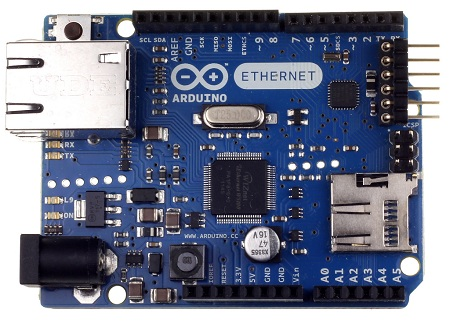

# Arduino Ethernet

####Company/Organization : Arduino
####OS supported : NONE
####Microcontroller : ATmega328
####Memory : EEPROM-1KB , SRAM-2KB
####Clock speed : 16 MHz
####Power supply ratings 
* Input Voltage : 7-12V (supplied from arduino board)
* Connector
  *Ethernet Controller: W5100 with internal 16K buffer
  *Connection with Arduino on SPI port 
  * 2.1mm center-positive plug	
  
  

#### Interfaces

|Type|Number|Count|
|---|---|---|
|GPIO|none|---|
|ADC|none|---|
|PWM|4|---|
|SPI|10,11,12,13|---|
|I2C|
|WiFi|none|---|
|Ethernet|10|---|
|HDMI|none|---|
	
####Tutorials

#### [Datasheet](http://www.atmel.com/Images/doc8161.pdf)
#### [Schematics](http://arduino.cc/en/uploads/Main/arduino-ethernet-R3-schematic.pdf)
#### [PCB Design](http://arduino.cc/en/uploads/Main/arduino-ethernet-R3-schematic.pdf)
